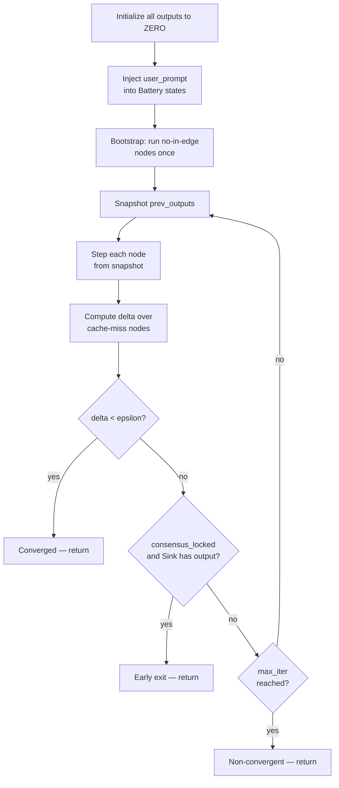

# Engine Loop

The CirKit engine runs a **synchronous Jacobi iteration** — every node reads the _previous_ iteration's outputs before producing its new output. No node can see another node's output from the same iteration. This makes circuits deterministic regardless of node evaluation order.

## How a single iteration works

Each iteration is three steps:

1. **Snapshot** — copy all current outputs as `prev_outputs`
2. **Step every node** — each node reads from the snapshot (not live outputs), produces a new output
3. **Check convergence** — compute delta between snapshot and new outputs; if low enough, stop

Because every node reads from the snapshot, the order nodes are stepped within an iteration doesn't matter. A motor can't see its sibling's new output until the next iteration.

## A concrete walkthrough

Consider a circuit: `battery → writer → reviewer → AND-Gate → sink`, with `gate → writer (feedback)` and `gate → reviewer (feedback)`. This is the canonical `pr_review.json` pattern.

**Before iter 1:** All outputs are `Signal.ZERO`. Battery fires once during bootstrap to seed its output.

**Iter 1:**
```
battery  → outputs task prompt (same every iter, cached after this)
writer   → sees [battery=task]. No feedback yet (ZERO, filtered). → produces draft_v1
reviewer → sees [battery=task, writer=ZERO(filtered)]. No draft to read yet. → blind review
AND-Gate → sees [writer=ZERO, reviewer=ZERO from prev]. No votes yet. → blocked (empty content)
```

**Iter 2:**
```
writer   → sees [battery=task, gate=ZERO(feedback, filtered)] → cached → draft_v1
reviewer → sees [battery=task, writer=draft_v1(peer)] → NOW has draft → review_v1
AND-Gate → sees [writer=draft_v1, reviewer=blind_review from iter 1] → may pass
```

**Iter 3:**
```
writer   → sees [battery=task, gate=merged_v1(feedback)] → new input → draft_v2
reviewer → sees [battery=task, writer=draft_v1(peer)] → review_v1 (cached)
AND-Gate → sees [writer=draft_v1, reviewer=review_v1] → passes → merged output → sink
```

**Iter 4:**
```
writer   → sees [battery=task, gate=merged_v2(feedback)] → refines → draft_v3
reviewer → sees [battery=task, writer=draft_v2(peer)] → review_v2
...outputs stabilize → delta < epsilon → converged
```

The key takeaway: **signals travel one iteration at a time**. Peer and feedback wires always carry the *previous* iteration's output. Iter 1 is always partially blind. Full collaboration starts iter 2–3.

---

## Phases



### Phase A — Initialize

All node outputs start as `Signal.ZERO`. A `RunState` object is created to track outputs, per-node state dicts, and delta history.

### Phase B — Inject user prompt

The engine writes the user prompt string into every Battery node's state dict (`state["user_prompt"]`) before any iteration runs. This is how the user's input enters the circuit without being hardcoded into the circuit JSON.

### Phase C — Bootstrap

Nodes with no in-edges (typically Batteries) are stepped once before iteration 0. This seeds their outputs so downstream nodes see real content on the first iteration rather than ZERO. Without the bootstrap, every node would receive only ZERO inputs on iteration 0 and produce ZERO outputs — the circuit would never start.

### Phase D — Main loop

For each iteration from 0 to `max_iter − 1`:

1. **Snapshot**: copy all current outputs as `prev_outputs`
2. **Step each node**: call `_maybe_cached_step(inputs_from_prev, state)` on every node
3. **Compute delta**: mean over nodes that produced a different output than last iteration (cache misses only — cached nodes contribute zero delta and are excluded from the mean)
4. **Check convergence**: if `delta < epsilon`, exit with `converged = True`
5. **Check early exit**: if `consensus_locked` flag is set AND the Sink has received positive-confidence content, exit early
6. **Fire callback**: `on_iter(iteration, delta, node_info)` if provided

### Phase E — Extract output

The Sink node's `state["last_input"]` is returned as the circuit's final output in a `RunResult`.

## Caching

Every node uses a lazy cache: if its inputs are identical to the previous call, it returns the cached output without doing any work. For Motors, this means no LLM call. For all other nodes, no recomputation.

The cache key is the set of non-ZERO input content hashes. ZERO signals are filtered before the key is built — this prevents cache misses when a peer wire delivers ZERO (no output yet) versus an actual signal.

Convergence delta is computed only over nodes that had a cache miss — nodes that produced new output. Nodes with cache hits contribute nothing to the mean, which means Battery (stable after iter 1) and Sink (always ZERO) are automatically excluded. Convergence reflects only what's actually changing.

## RunResult

```python
@dataclass
class RunResult:
    output: Signal        # Sink's selected signal
    iterations: int       # How many iterations ran
    converged: bool       # True if delta < epsilon before max_iter
    delta_history: list   # Per-iteration aggregate delta values
    all_outputs: dict     # Final outputs keyed by node id
```

## Non-convergence

If `max_iter` is reached without `delta < epsilon`, the engine returns normally with `converged = False` — no exception is raised. The output is whatever the Sink last collected.

Non-convergence in feedback-loop circuits usually means the motors are still debating. Causes and fixes:

- **AND-Gate threshold too high**: motors can't produce high enough confidence on iterative tasks. Lower to 0.45–0.55.
- **Wrong confidence semantics**: Motor system prompt rates confidence on outcome ("no bugs found → high confidence") rather than completeness. The gate blocks every iteration because motors never reach the threshold. Fix the system prompt — confidence must reflect thoroughness, not findings.
- **Feedback wired from a node with no real output yet**: on iteration 1, all nodes start at `Signal.ZERO`. A motor with a feedback wire sees `ZERO` (filtered out) and works from context alone. Real feedback arrives starting iteration 2. This is expected — not a sign of misconfiguration.

## Callback

Pass `on_iter` to `run()` to receive live iteration events:

```python
def on_iter(iteration: int, delta: float, node_info: dict):
    print(f"iter {iteration}, delta={delta:.4f}")

result = run(circuit, "my prompt", on_iter=on_iter)
```

The CLI and UI dev server use this callback to stream `[iter N, delta=X]` and per-node status lines to stdout and the browser respectively.
