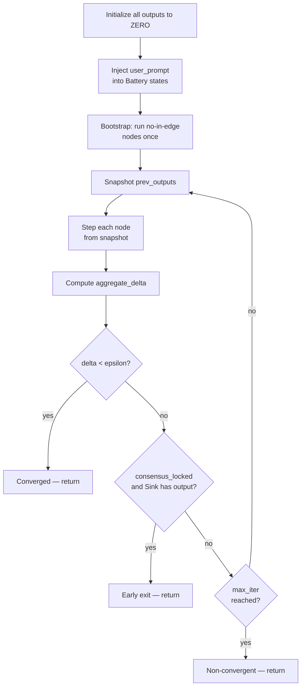

# Engine Loop

The CirKit engine runs a **synchronous Jacobi iteration** — every node reads the _previous_ round's outputs before any node writes its new output. This prevents ordering artifacts and makes circuits deterministic regardless of node evaluation order.

## Phases



### Phase A — Initialize

All node outputs start as `Signal.ZERO`. A `RunState` object is created to track outputs, per-node state dicts, and delta history.

### Phase B — Inject user prompt

The engine writes the user prompt string into every Battery node's state dict (`state["user_prompt"]`) before any iteration runs. This is how the user's input enters the circuit without being hardcoded into the circuit JSON.

### Phase C — R9 Bootstrap

Nodes with no in-edges (typically Batteries) are stepped once before iteration 0. This seeds their outputs so downstream nodes see real content on the first iteration rather than ZERO. Without the bootstrap, every node would receive only ZERO inputs on iteration 0 and produce ZERO outputs — the circuit would never start.

### Phase D — Main loop

For each iteration from 0 to `max_iter − 1`:

1. **Snapshot**: copy all current outputs as `prev_outputs`
2. **Step each node**: call `_maybe_cached_step(inputs_from_prev, state)` on every node
3. **Compute delta**: `aggregate_delta(prev_outputs, curr_outputs)` — mean across all nodes
4. **Check convergence (R10)**: if `delta < epsilon`, exit with `converged = True`
5. **Check early exit (R4/G14)**: if `consensus_locked` flag is set AND the Sink has received positive-confidence content, exit early
6. **Fire callback**: `on_iter(iteration, outputs, delta)` if provided

### Phase E — Extract output

The Sink node's `state["last_input"]` is returned as the circuit's final output in a `RunResult`.

## RunResult

```python
@dataclass
class RunResult:
    output: Signal        # Sink's selected signal
    iterations: int       # How many iterations ran
    converged: bool       # True if delta < epsilon before max_iter
    delta_history: list   # Per-iteration aggregate delta values
    all_outputs: dict     # Final outputs keyed by node id
```

## Non-convergence

If `max_iter` is reached without `delta < epsilon`, the engine returns normally with `converged = False` — no exception is raised. The output is whatever the Sink last collected.

Non-convergence in feedback-loop circuits usually means the motors are still debating. Causes and fixes:

- **AND-Gate threshold too high**: motors can't produce high enough confidence on iterative tasks. Lower to 0.45–0.55.
- **Wrong confidence semantics**: Motor system prompt rates confidence on outcome ("no bugs found → high confidence") rather than completeness. The gate blocks, sends `[BLOCKED]` as feedback, and the motors can't improve. Fix the system prompt.
- **Feedback from a blocked gate**: the feedback wire points to the AND-Gate rather than the synthesizer. Blocked gate emits `[BLOCKED: insufficient confidence]` as content — useless for refinement.

## Callback

Pass `on_iter` to `run()` to receive live iteration events:

```python
def on_iter(iteration: int, outputs: dict[str, Signal], delta: float):
    print(f"iter {iteration}, delta={delta:.4f}")

result = run(circuit, "my prompt", on_iter=on_iter)
```

The CLI and UI dev server use this callback to stream `[iter N, delta=X]` and per-node status lines to stdout and the browser respectively.
