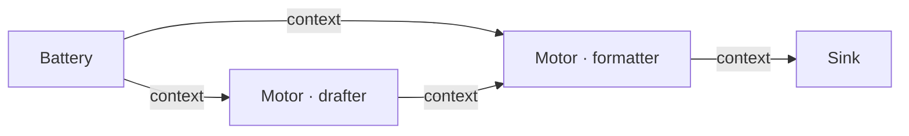
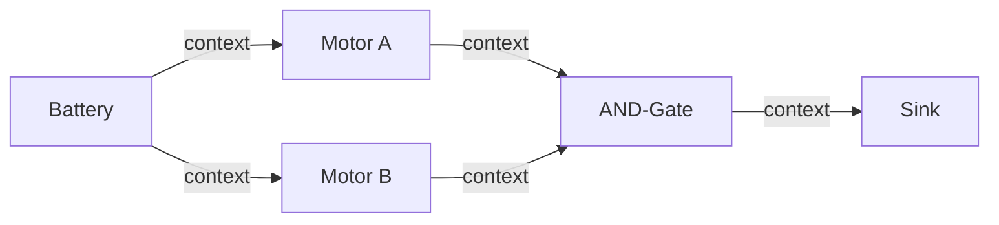
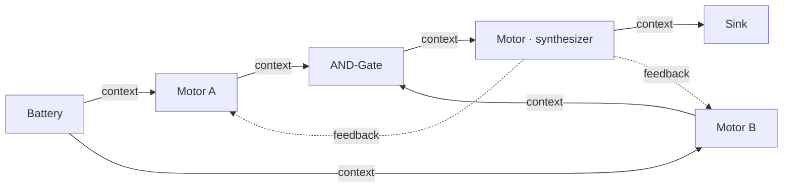
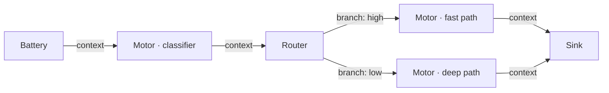

# Circuit Design Patterns

## How iteration works — the basics

Before picking a pattern, understand the iteration model:

- **All nodes fire every iteration**, using the previous iteration's outputs as inputs.
- **Peer and feedback wires have a 1-iteration lag** — a node with a peer wire from a sibling sees `Signal.ZERO` on iter 1 (sibling had no output yet) and real content starting iter 2.
- **Iter 1 is always partially blind** — motors with peer wires haven't seen their siblings' work yet. Full collaboration starts iter 2–3.
- **Cached nodes are free** — if a node's inputs didn't change, it returns its previous output without doing any work. No LLM call.

---

## Pattern 1 — Linear pipeline

**When to use**: sequential generation tasks — draft something, then transform it. One stage feeds the next. No debate, no iteration, no feedback loop.



The drafter produces content. The formatter receives both the task (from Battery) and the draft (from drafter) and converts it. Converges in 1–2 iterations once the formatter produces stable output.

```json
{
  "config": {"epsilon": 0.05, "max_iter": 3},
  "sink": "out",
  "nodes": [
    {"id": "task",    "type": "battery", "config": {"content": "Build a resume for:"}},
    {"id": "drafter", "type": "motor",   "config": {"system": "Organize the input into resume sections: Summary, Experience, Education, Skills. Output structured prose only, no HTML."}},
    {"id": "coder",   "type": "motor",   "config": {"system": "Convert the resume content into a single self-contained HTML file with inline CSS. Output ONLY valid HTML."}},
    {"id": "out",     "type": "sink",    "config": {}}
  ],
  "wires": [
    {"from": "task",    "to": "drafter", "role": "context"},
    {"from": "task",    "to": "coder",   "role": "context"},
    {"from": "drafter", "to": "coder",   "role": "context"},
    {"from": "coder",   "to": "out",     "role": "context"}
  ]
}
```

Battery wires to both motors with `context`. Drafter output flows to formatter with `context` — it's upstream input, not a sibling peer.

!!! tip
    Don't add a gate or feedback loop to a linear pipeline. There is no disagreement to resolve. Adding one risks blocking oscillation without improvement.

Example: `examples/resume_html.json`

---

## Pattern 2 — Parallel review + consensus gate

**When to use**: tasks where multiple independent specialists must each produce a confident analysis before the output advances. Each motor analyzes the same source independently. Neither sees the other's work.



The AND-Gate passes only when ALL non-ZERO inputs exceed the `threshold`. When blocked, it emits `contradiction=1.0`, which forces upstream motors to bypass their cache and re-run on the next iteration.

Use `merge_mode: concat` — the gate concatenates passing outputs and sends them to Sink. No synthesizer needed.

**Key rules:**
- Both motors wire from Battery directly — they analyze the same input independently
- Gate threshold: 0.45–0.55 for most circuits
- Do NOT wire motors to each other — for independent parallel analysis, only `battery → motor` wires are needed. A peer wire between them would make each motor's output depend on the other's.

---

## Pattern 2b — Parallel review + synthesizer + feedback

**When to use**: same as Pattern 2, but you want LLM-quality fusion of the passing outputs AND iterative refinement — motors improve their analysis based on the fused result.



The gate uses `merge_mode: synthesize`, which concatenates passing inputs and sets a flag. The synthesizer Motor reads that flag and calls the LLM to fuse the content into one coherent output.

Feedback wires carry the synthesizer's output back to the motors on the next iteration. Motors see `[FEEDBACK FROM PREVIOUS ITERATION]` in their prompt and can refine their analysis accordingly.

!!! warning "merge_mode: synthesize does not call the LLM"
    `synthesize` mode only concatenates inputs and sets a flag. The downstream synthesizer **Motor** is what actually calls the LLM to produce the fused result. Without the Motor, the flag goes nowhere.

!!! warning "Gate threshold must be low enough to pass on the first real iteration"
    If the gate blocks every iteration, it emits `[BLOCKED: insufficient confidence]` as content. The synthesizer receives this useless input, produces garbage, and motors get garbage feedback. Lower the threshold to 0.45–0.55 so the gate passes when motors produce normally-confident output.

**Iteration walkthrough for this pattern:**

| Iter | Motors see | Gate sees | Synthesizer sees |
|------|-----------|-----------|-----------------|
| 1 | Battery only (no feedback yet) | Previous iter outputs (ZERO) → blocked | Gate output (ZERO) → nothing |
| 2 | Battery + ZERO feedback (filtered) → cached | Motor outputs from iter 1 → passes | Gate blocked output from iter 1 → low-quality fusion |
| 3 | Battery + low-quality feedback → refine | Motor outputs from iter 2 (cached) → passes | Gate passing output from iter 2 → good fusion |
| 4 | Battery + good feedback → converge | … | … |

The pipeline takes 2–3 iterations to "warm up" before useful feedback flows. This is expected — not a sign of misconfiguration.

Example: `examples/pr_review.json`

---

## Pattern 3 — Content routing

**When to use**: dispatch to different specialist motors based on the signal's properties. Avoids running an expensive full pipeline on trivial inputs.



The classifier scores the input and emits a confidence signal. The Router inspects that signal and sends it down the matching branch.

```json
{
  "id": "triage",
  "type": "router",
  "config": {
    "rule": "by_confidence",
    "branches": [
      {"branch": "high", "min_confidence": 0.8},
      {"branch": "low",  "default": true}
    ]
  }
}
```

---

## Pitfalls

### Critic gates every iteration (oscillation)

**Symptom**: circuit hits `max_iter` every run. Delta never converges. Gate always blocked.

**Cause**: Motor system prompt says "output LOW confidence if issues found." Gate blocks. Gate sends `[BLOCKED: insufficient confidence]` to the synthesizer. Synthesizer produces garbage. Motors get garbage feedback. Repeat.

**Fix**: confidence must reflect *completeness of analysis*, not *absence of issues*. A reviewer who finds five bugs but analyzed every file thoroughly should output high confidence.

```
WRONG: "Output confidence: 0.9 if no vulnerabilities found."
RIGHT: "Output confidence: 0.9 if you reviewed all aspects of the change thoroughly."
```

### Reviewer can't see the written content

**Symptom**: reviewer output is generic; ignores the specific content it should critique.

**Cause**: only `battery → reviewer (context)` wire was added. Reviewer sees the task but not the writer's output.

**Fix**: add `writer → reviewer (peer)`. The reviewer needs the draft to critique it.

Note: in Pattern 2 (parallel independent reviewers), this wire is intentionally absent — each motor analyzes the same source independently. Only add the peer wire when you explicitly want one motor to read and respond to another's output.

### Feedback from a blocked gate

**Symptom**: motors oscillate; feedback content is `[BLOCKED: insufficient confidence]`.

**Cause**: feedback wire points to the AND-Gate directly rather than a downstream synthesizer. A blocked gate emits `[BLOCKED]` as content — not a real analysis.

**Fix**: wire feedback from the synthesizer. If you don't need LLM-quality synthesis, use Pattern 2 (gate directly to sink) and skip the feedback loop entirely.

### AND-Gate threshold above 0.6

**Symptom**: gate never passes; motors can't reach the required confidence on iterative tasks.

**Fix**: lower threshold to 0.45–0.55. Use `early_exit_threshold: 0.85` for the "exit fast when clearly done" case.

### Redundant Resistor

If a Resistor's `threshold` equals the downstream AND-Gate's `threshold`, it adds nothing — the gate already rejects any input below its threshold. Only use a Resistor when you need to raise the bar for one specific input *above* the general gate threshold.

### Peer wire between independent reviewers

**Symptom**: motor B's output is influenced by motor A's draft even though they're meant to analyze independently.

**Cause**: `motor_a → motor_b (peer)` wire was added when both motors should analyze the same source input without awareness of each other.

**Fix**: remove the peer wire. Both motors read from Battery directly. Only add a peer wire when you explicitly want cross-awareness.
