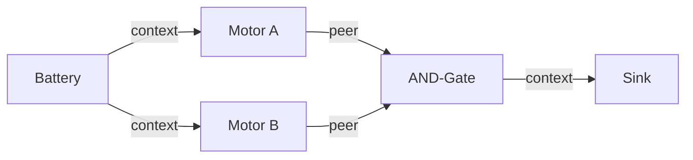
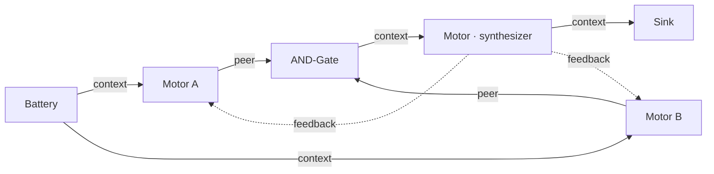
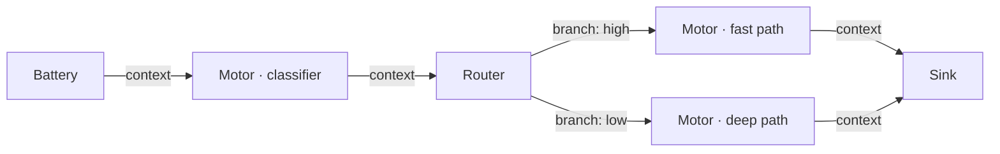

# Circuit Design Patterns

## Pattern 1 — Linear pipeline

**When to use**: generation tasks — write a report, convert a format, summarize a document. The output improves in a single pass; there is nothing to debate or iterate on.


Each motor refines the previous stage's output. Converges in 1–2 iterations once the formatter produces stable output.

```json
{
  "config": {"epsilon": 0.05, "max_iter": 3},
  "sink": "out",
  "nodes": [
    {"id": "task",    "type": "battery", "config": {"content": "Draft resume HTML for:"}},
    {"id": "drafter", "type": "motor",   "config": {"system": "Draft a prose resume. End with {\"confidence\": 0.9}."}},
    {"id": "coder",   "type": "motor",   "config": {"system": "Convert the prose resume to clean HTML. End with {\"confidence\": 0.9}."}},
    {"id": "out",     "type": "sink",    "config": {}}
  ],
  "wires": [
    {"from": "task",    "to": "drafter", "role": "context"},
    {"from": "drafter", "to": "coder",   "role": "peer"},
    {"from": "coder",   "to": "out",     "role": "context"}
  ]
}
```

!!! tip
    Don't add a gate or feedback loop to a linear pipeline — there is no disagreement to resolve. Adding one risks oscillation without improvement.

Example: `examples/resume_html.json`

---

## Pattern 2 — Parallel review + consensus gate

**When to use**: tasks where multiple independent specialists must each produce a confident analysis before the output advances. Neither motor sees the other's work — they analyze the same input independently and in parallel.



The AND-Gate passes only when all inputs exceed the `threshold`. When blocked, it emits `contradiction=1.0`. This triggers the R2 cache bypass in any Motor that receives it as input — forcing a fresh LLM call without needing an explicit retry loop.

Use `merge_mode: concat` for this pattern. The gate concatenates the passing outputs and sends them to the Sink. No synthesizer needed.

**Key rules**:
- Both motors read from Battery directly — they analyze the same input, not each other's output
- Gate threshold: 0.45–0.55 for most circuits
- Do NOT wire motors to each other with `peer` unless you want each to see the other's draft; for independent analysis, only Battery → motor wires are needed

---

## Pattern 2b — Parallel review + synthesizer

An extension of Pattern 2 for when you want LLM-quality fusion of the passing outputs rather than simple concatenation.



The gate uses `merge_mode: synthesize`, which concatenates passing inputs and sets `flags["needs_synthesis"] = True`. The synthesizer Motor receives this flagged content and calls the LLM to fuse it into one coherent output.

!!! warning "merge_mode: synthesize does not call the LLM"
    The AND-Gate's `synthesize` mode only concatenates inputs and sets a flag. The downstream synthesizer **Motor** is what actually calls the LLM to produce the fused result. Without the Motor, the flag goes nowhere.

**Feedback**: the synthesizer's output flows back to the motors as `feedback` so they can refine against the fused draft in the next iteration. This is only meaningful when the gate **passes** and the synthesizer receives real content.

!!! warning "What happens when the gate blocks"
    If the gate blocks (`confidence < threshold`), it emits `content="[BLOCKED: insufficient confidence]"` to the synthesizer. The synthesizer Motor receives this, bypasses its cache (R2: `contradiction=1.0`), and calls the LLM with useless input. The resulting feedback to the motors is low-quality. Retries still happen — the changing synthesizer output changes the motors' cache keys, triggering fresh calls — but without useful feedback content.

    This is why the gate threshold must be set low enough (0.45–0.55) that it passes on the first iteration with normally-confident motor outputs. A gate that blocks frequently will produce garbage feedback loops rather than useful iteration.

Example: `examples/pr_review.json`

---

## Pattern 3 — Content routing

**When to use**: dispatch to different specialist motors based on the signal's properties. Avoids running an expensive full pipeline on trivial inputs.



The classifier scores the input and emits a confidence signal. The Router inspects that signal and sends it down the matching branch.

```json
{
  "id": "triage",
  "type": "router",
  "config": {
    "rule": "by_confidence",
    "branches": [
      {"branch": "high", "min_confidence": 0.8},
      {"branch": "low",  "default": true}
    ]
  }
}
```

---

## Pitfalls

### Critic gates every iteration (oscillation)

**Symptom**: circuit hits `max_iter` every run. Delta never converges. Gate always blocked.

**Cause**: Motor system prompt says "output LOW confidence if issues found." Gate blocks. Gate sends `[BLOCKED: insufficient confidence]` to the synthesizer. Synthesizer produces garbage. Motors get garbage feedback. Repeat.

**Fix**: confidence must reflect *completeness of analysis*, not *absence of issues*. A reviewer who finds five bugs but analyzed every file thoroughly should output high confidence.

```
WRONG: "Output confidence: 0.9 if no vulnerabilities found."
RIGHT: "Output confidence: 0.9 if you reviewed all aspects of the change thoroughly."
```

### Reviewer can't see the written content

**Symptom**: reviewer output is generic; ignores the specific content it should critique.

**Cause**: only `battery → reviewer` wire was added. Reviewer sees the task but not the writer's output.

**Fix**: add `writer → reviewer` with `role: peer`. Note that in Pattern 2 (parallel independent reviewers), this wire is intentionally absent — each motor analyzes the same source independently. Only add the peer wire if you want one motor to explicitly review another's output.

### Feedback from a blocked gate

**Symptom**: motors oscillate; feedback content is `[BLOCKED: insufficient confidence]`.

**Cause**: feedback wire points to the AND-Gate directly rather than to a downstream synthesizer. A blocked gate emits `[BLOCKED]` as content.

**Fix**: never wire feedback from the gate. Wire it from the synthesizer — or, if you don't need LLM-quality synthesis, use Pattern 2 (gate directly to sink) and omit the feedback loop entirely.

### Epsilon too high for your topology

**Symptom**: circuit exits after 1 iteration even though output quality is low.

**Cause**: `aggregate_delta` is a mean across *all* nodes, including constant-output nodes. A Sink always emits `Signal.ZERO`, so its delta is always 0. In a 5-node circuit with 1 active Motor, the Motor's real delta is diluted by 5 in the aggregate.

**Fix**: use `epsilon` around 0.03–0.05. For circuits with many passive nodes relative to active ones, go lower (0.01). See [Convergence](../concepts/convergence.md) for the tuning formula.

### AND-Gate threshold above 0.6

**Symptom**: gate never passes; motors can't reach the required confidence on iterative tasks.

**Fix**: lower threshold to 0.45–0.55. Use `early_exit_threshold: 0.85` for the "exit fast when clearly done" case.

### Redundant Resistor

If a Resistor's `threshold` equals the downstream AND-Gate's `threshold`, it adds nothing — the gate already rejects any input below its threshold. Only use a Resistor when you need to raise the bar for one specific input *above* the general gate threshold.
