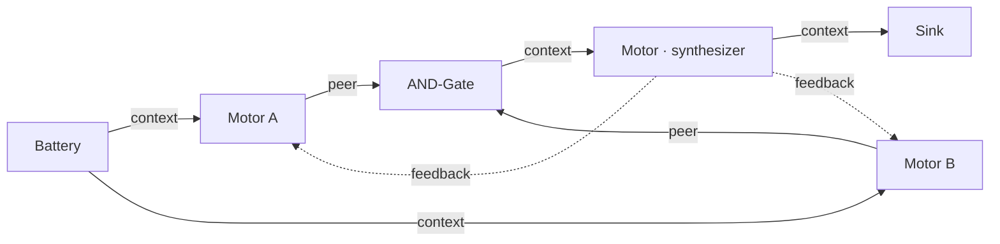
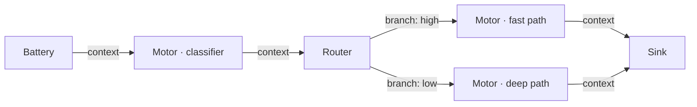

# Circuit Design Patterns

## Pattern 1 — Linear pipeline

**When to use**: generation tasks — write a report, convert a format, summarize a document. The output improves in a single pass; there is nothing to debate or iterate on.


Each motor refines the previous stage's output. The pipeline converges in 1–2 iterations — once the formatter produces output, nothing changes.

```json
{
  "config": {"epsilon": 0.05, "max_iter": 3},
  "sink": "out",
  "nodes": [
    {"id": "task",    "type": "battery", "config": {"content": "Draft resume HTML for:"}},
    {"id": "drafter", "type": "motor",   "config": {"system": "Draft a prose resume. End with {\"confidence\": 0.9}."}},
    {"id": "coder",   "type": "motor",   "config": {"system": "Convert the prose resume to clean HTML. End with {\"confidence\": 0.9}."}},
    {"id": "out",     "type": "sink",    "config": {}}
  ],
  "wires": [
    {"from": "task",    "to": "drafter", "role": "context"},
    {"from": "drafter", "to": "coder",   "role": "peer"},
    {"from": "coder",   "to": "out",     "role": "context"}
  ]
}
```

!!! tip
    Don't add a gate or feedback loop to a linear pipeline — there's no disagreement to resolve. Adding one risks oscillation without improvement.

Example: `examples/resume_html.json`

---

## Pattern 2 — Parallel review + consensus gate

**When to use**: tasks where multiple independent perspectives must agree before the output advances. Useful for code review, fact-checking, multi-criteria evaluation.



The AND-Gate passes only when both motors exceed the confidence threshold. The synthesizer fuses their outputs into a coherent result. Feedback from the synthesizer (not the gate) lets motors refine in the next iteration.

**Key wiring rules**:

- Battery → each Motor with `role: context` (task description and user prompt)
- Each Motor → AND-Gate with `role: peer`
- AND-Gate `threshold`: 0.45–0.55 for most circuits
- Feedback from the **synthesizer** — never from the gate (a blocked gate emits `[BLOCKED]`, which is useless as feedback)

Example: `examples/pr_review.json`

---

## Pattern 3 — Content routing

**When to use**: dispatch to different specialist motors based on the signal's properties. Avoids running an expensive full pipeline on trivial inputs.



The classifier scores the input and emits a confidence signal. The Router inspects that signal and sends it down the matching branch.

```json
{
  "id": "triage",
  "type": "router",
  "config": {
    "rule": "by_confidence",
    "branches": [
      {"branch": "high", "min_confidence": 0.8},
      {"branch": "low",  "default": true}
    ]
  }
}
```

---

## Pitfalls

### Critic gates every iteration (oscillation)

**Symptom**: circuit hits `max_iter` every run. Delta never converges. Gate always blocked.

**Cause**: Motor system prompt says "output LOW confidence if issues found." Gate blocks. Gate sends `[BLOCKED: insufficient confidence]` as feedback. Motors re-run with useless feedback. Repeat.

**Fix**: confidence must reflect *completeness of analysis*, not *absence of issues*. A reviewer who finds five bugs but analyzed every file thoroughly should output high confidence.

```
WRONG: "Output confidence: 0.9 if no vulnerabilities found."
RIGHT: "Output confidence: 0.9 if you reviewed all aspects of the change thoroughly."
```

### Reviewer can't see the written content

**Symptom**: reviewer output is generic; ignores the specific content it should critique.

**Cause**: only `battery → reviewer` wire was added. Reviewer sees the task but not the writer's output.

**Fix**: add `writer → reviewer` with `role: peer`.

### Feedback from a blocked gate

**Symptom**: motors oscillate; feedback content is `[BLOCKED: insufficient confidence]`.

**Cause**: feedback wire points to the AND-Gate, which emits that string when blocked.

**Fix**: wire feedback from the Synthesizer — it always produces real content regardless of whether the gate passed or blocked on the previous iteration.

### Epsilon too high for your topology

**Symptom**: circuit exits after 1 iteration even though output quality is low.

**Cause**: `aggregate_delta` is a mean across *all* nodes, including constant-output nodes. A Sink always emits `Signal.ZERO`, so its delta is always 0. In a 5-node circuit with 1 active Motor, the Motor's real delta is diluted by 5 in the aggregate.

**Fix**: use `epsilon` around 0.03–0.05. For circuits with many passive nodes relative to active ones, go lower (0.01). See [Convergence](../concepts/convergence.md) for the tuning formula.

### AND-Gate threshold above 0.6

**Symptom**: gate never passes; motors can't reach the required confidence on iterative tasks.

**Fix**: lower threshold to 0.45–0.55. Use `early_exit_threshold: 0.85` for the "exit fast when clearly done" case.

### Redundant Resistor

If a Resistor's `threshold` equals the downstream AND-Gate's `threshold`, it adds nothing — the gate already rejects any input below its threshold. Only use a Resistor when you need to raise the bar for one specific input *above* the general gate threshold.
