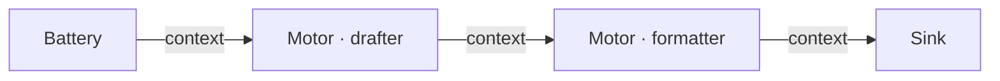
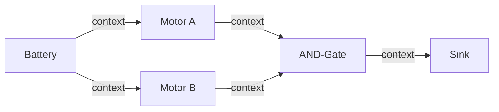
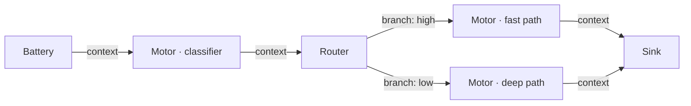

# Circuit Design Patterns

## How iteration works — the basics

Before picking a pattern, understand the iteration model:

- **All nodes fire every iteration**, using the previous iteration's outputs as inputs.
- **Peer and feedback wires have a 1-iteration lag** — a node with a peer wire from a sibling sees `Signal.ZERO` on iter 1 (sibling had no output yet) and real content starting iter 2.
- **Iter 1 is always partially blind** — motors with peer wires haven't seen their siblings' work yet. Full collaboration starts iter 2–3.
- **Cached nodes are free** — if a node's inputs didn't change, it returns its previous output without doing any work. No LLM call.

---

## Pattern 1 — Linear pipeline

**When to use**: sequential generation tasks — draft something, then transform it. One stage feeds the next. No debate, no iteration, no feedback loop.



The drafter produces content. The formatter receives the draft and converts it. Converges in 1–2 iterations once the formatter produces stable output. The formatter does not need a direct Battery wire — the drafter's output already carries all the context it needs.

```json
{
  "config": {"epsilon": 0.05, "max_iter": 3},
  "sink": "out",
  "nodes": [
    {"id": "task",    "type": "battery", "config": {"content": "Build a resume for:"}},
    {"id": "drafter", "type": "motor",   "config": {"system": "Organize the input into resume sections: Summary, Experience, Education, Skills. Output structured prose only, no HTML."}},
    {"id": "coder",   "type": "motor",   "config": {"system": "Convert the resume content into a single self-contained HTML file with inline CSS. Output ONLY valid HTML."}},
    {"id": "out",     "type": "sink",    "config": {}}
  ],
  "wires": [
    {"from": "task",    "to": "drafter", "role": "context"},
    {"from": "drafter", "to": "coder",   "role": "context"},
    {"from": "coder",   "to": "out",     "role": "context"}
  ]
}
```

Battery wires only to the drafter. Drafter output flows to formatter with `context` — it's upstream input, not a sibling peer. Each stage works from the previous stage's output; no node needs to skip stages to read raw user input.

!!! tip
    Don't add a gate or feedback loop to a linear pipeline. There is no disagreement to resolve. Adding one risks blocking oscillation without improvement.

Example: `examples/resume_html.json`

---

## Pattern 2 — Parallel review + consensus gate

**When to use**: tasks where multiple independent specialists must each produce a confident analysis before the output advances. Each motor analyzes the same source independently. Neither sees the other's work.



The AND-Gate passes only when ALL non-ZERO inputs exceed the `threshold`. When blocked, it emits `contradiction=1.0` with the **real merged content** of all inputs — not a placeholder string. This forces upstream motors to bypass their cache (R2) and re-run with the actual combined output as context, so they can identify gaps and refine.

Use `merge_mode: concat` or `dedupe` — the gate merges passing outputs and sends to Sink. Wire `gate → motor (feedback)` for iterative refinement; motors receive the merged content and refine on the next iteration.

**Key rules:**
- Both motors wire from Battery directly — they analyze the same input independently
- Gate threshold: 0.45–0.55 for most circuits
- Do NOT wire motors to each other — for independent parallel analysis, only `battery → motor` wires are needed. A peer wire between them would make each motor's output depend on the other's.

See `examples/pr_review.json` for the canonical implementation of this pattern with feedback.

---

## Pattern 3 — Content routing

**When to use**: dispatch to different specialist motors based on the signal's properties. Avoids running an expensive full pipeline on trivial inputs.



The classifier scores the input and emits a confidence signal. The Router inspects that signal and sends it down the matching branch.

```json
{
  "id": "triage",
  "type": "router",
  "config": {
    "rule": "by_confidence",
    "branches": [
      {"branch": "high", "min_confidence": 0.8},
      {"branch": "low",  "default": true}
    ]
  }
}
```

---

## Pitfalls

### Critic gates every iteration (oscillation)

**Symptom**: circuit hits `max_iter` every run. Delta never converges. Gate always blocked.

**Cause**: Motor system prompt says "output LOW confidence if issues found." Gate blocks every iteration. Motors receive the merged (blocked) output as feedback but can't improve because their confidence instruction is inverted.

**Fix**: confidence must reflect *completeness of analysis*, not *absence of issues*. A reviewer who finds five bugs but analyzed every file thoroughly should output high confidence.

```
WRONG: "Output confidence: 0.9 if no vulnerabilities found."
RIGHT: "Output confidence: 0.9 if you reviewed all aspects of the change thoroughly."
```

### Reviewer can't see the written content

**Symptom**: reviewer output is generic; ignores the specific content it should critique.

**Cause**: only `battery → reviewer (context)` wire was added. Reviewer sees the task but not the writer's output.

**Fix**: add `writer → reviewer (peer)`. The reviewer needs the draft to critique it.

Note: in Pattern 2 (parallel independent reviewers), this wire is intentionally absent — each motor analyzes the same source independently. Only add the peer wire when you explicitly want one motor to read and respond to another's output.

### Feedback loop never converges (epsilon too low)

**Symptom**: motors oscillate at stable confidence but delta stays above epsilon. Circuit hits `max_iter`.

**Cause**: LLMs produce slightly different text on every call even with identical prompts. With the default `epsilon: 0.05`, content drift alone (0.1 per cache-miss node) can exceed the threshold when multiple motors are active.

**Fix**: raise epsilon to `0.15` for circuits with feedback loops. Metric stability (confidence, contradiction) is the real convergence signal — content drift is noise.

### AND-Gate threshold above 0.6

**Symptom**: gate never passes; motors can't reach the required confidence on iterative tasks.

**Fix**: lower threshold to 0.45–0.55. Use `early_exit_threshold: 0.85` for the "exit fast when clearly done" case.

### Redundant Resistor

If a Resistor's `threshold` equals the downstream AND-Gate's `threshold`, it adds nothing — the gate already rejects any input below its threshold. Only use a Resistor when you need to raise the bar for one specific input *above* the general gate threshold.

### Peer wire between independent reviewers

**Symptom**: motor B's output is influenced by motor A's draft even though they're meant to analyze independently.

**Cause**: `motor_a → motor_b (peer)` wire was added when both motors should analyze the same source input without awareness of each other.

**Fix**: remove the peer wire. Both motors read from Battery directly. Only add a peer wire when you explicitly want cross-awareness.
