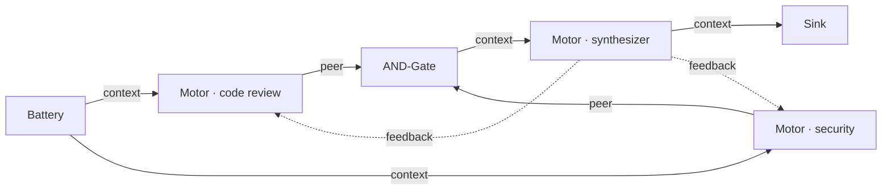

# CirKit

**Signal circuit reasoning engine.** Define a graph of nodes in JSON; signals flow through it until outputs converge. The LLM is one node type — the circuit is the orchestration.

The diagram below is the `examples/pr_review.json` circuit. Two motors independently analyze the same input in parallel. The AND-Gate passes when both are confident. The synthesizer fuses their outputs into one coherent report. Feedback from the synthesizer lets both motors refine in subsequent iterations.



Signals carry `content`, `confidence`, `contradiction`, and other metrics. Each iteration, every node reads the previous round's outputs and produces a new signal. The loop runs until `Δ < ε` — convergence — or `max_iter` is reached.

## Why CirKit

**Declarative over imperative.** In most LLM frameworks you write Python that calls models, inspects results, decides what to retry, and knows when to stop. In CirKit you describe *topology* — which nodes exist and how they connect — and the engine handles iteration, retry, and termination automatically. Changing a circuit means editing JSON, not refactoring code.

**Convergence as a first-class primitive.** Rather than running a fixed number of steps, the engine measures how much each node's output changed between iterations and stops when the circuit has settled. Simple tasks converge fast (often 1–2 iterations); complex iterative tasks get as many rounds as they need, up to `max_iter`.

**Reproducible by default.** Motor nodes cache outputs by input content hash. Same circuit + same prompt = same output, regardless of how many times it runs.

## Quick start

```bash
pip install -e .
python -m cirkit run examples/pr_review.json "Review this PR: adds retry logic to payment service"
```

Or launch the visual canvas:

```bash
python ui/server.py    # → http://localhost:8080
```

- [Full quickstart guide](guides/quickstart.md)
- [Circuit design patterns](guides/circuit-design.md)
- [Codebase architecture](reference/architecture.md)
