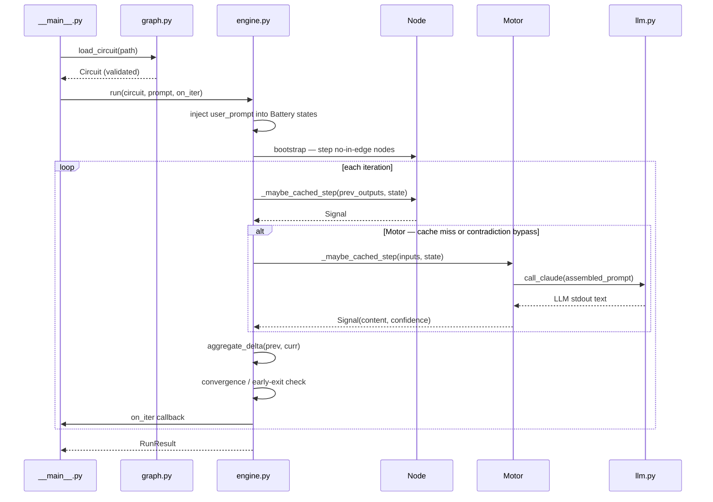

# Codebase Architecture

CirKit is organized in three independent layers: the **data model** (`signal`, `graph`, `state`), the **execution engine** (`engine`, `convergence`), and the **node library** (`nodes/`). The engine knows nothing about specific node types — it only calls `_maybe_cached_step` on each node and measures output deltas. Adding a new node type requires no engine changes.

## Module map

```mermaid
flowchart TD
    signal["signal.py\nSignal dataclass · ZERO sentinel"]
    convergence["convergence.py\ndelta() · aggregate_delta()"]
    confidence["confidence.py\nJSON tail parser · heuristic fallback"]
    llm["llm.py\ncall_claude() subprocess wrapper"]
    base["nodes/base.py\nNode ABC · LRU cache · _maybe_cached_step"]
    motor["nodes/motor.py\nLLM node · contradiction bypass"]
    other["nodes/\nbattery · sink · resistor · and_gate · router"]
    registry["nodes/__init__.py\nNODE_REGISTRY — type string → class"]
    state["state.py\nRunState · RunResult"]
    graph["graph.py\nCircuit · Wire · load_circuit() + validation"]
    engine["engine.py\nJacobi loop · bootstrap · convergence check"]
    main["__main__.py\nCLI entry point"]
    utils["ui/circuit_utils.py\nvalidate_circuit() · parse_cirkit_line()"]
    server["ui/server.py\nstdlib dev server · ndjson stream"]

    signal --> convergence
    signal --> base
    signal --> state
    signal --> graph
    base --> motor
    base --> other
    llm --> motor
    confidence --> motor
    motor --> registry
    other --> registry
    registry --> graph
    graph --> engine
    state --> engine
    convergence --> engine
    engine --> main
    graph --> main
    graph --> utils
    engine --> server
    utils --> server
```

## Call flow

When `cirkit run circuit.json "prompt"` executes:



## Key design decisions

### Jacobi (synchronous) update

Every node reads the *previous* iteration's outputs — never the current one. This has two consequences:

1. **Ordering independence**: a node evaluated early in the loop has no advantage over one evaluated late. Circuits are deterministic regardless of dict iteration order.
2. **Safe cycles**: a feedback edge carries the *last* iteration's downstream output into the *current* iteration's upstream input — exactly the discrete-time semantics needed for iterative refinement. No special-casing for cycles in the step loop.

### Frozen signals

`Signal` is a `frozen=True` dataclass. The `flags` field additionally uses `MappingProxyType`. `frozen=True` prevents attribute reassignment but does not stop in-place dict mutation — `MappingProxyType` closes that gap. Signals are therefore safe to share across nodes and iterations without defensive copies.

### Lazy LRU cache in Node base

`_maybe_cached_step` in `base.py` checks a 64-entry LRU cache keyed by sorted input content hashes before calling `step()`. Two rules apply:

- **C1**: `Signal.ZERO` inputs are excluded from cache keys. This prevents spurious cache misses when zero-padded inputs arrive in different orderings.
- **R2** (Motor only): if any input has `contradiction ≥ 0.8`, the cache is bypassed entirely and the LLM is called fresh. High contradiction signals that a reviewer rejected the answer — returning a cached rejected answer would be wrong.

Motor overrides `_maybe_cached_step` to apply R2. All other node types inherit the C1-only base behavior.

### Motor via subprocess + stdin

`call_claude()` spawns `claude -p` as a subprocess and passes the assembled prompt via **stdin**, not argv. This avoids Windows command-line quoting issues with special characters and sidesteps OS argument-length limits for long prompts.

### NODE_REGISTRY

`nodes/__init__.py` holds a string → class dict. `load_circuit()` looks up each node's `type` field in this registry at parse time. To add a node type: subclass `Node`, implement `step()`, add one line to the registry. The engine, graph, and validation layers don't change.

## ui/ layer

The UI (`ui/server.py` and `ui/views.py`) sits outside the core engine. Both import `ui/circuit_utils.py`, which provides two functions used by both the stdlib server and the Django integration:

- `validate_circuit(json_dict)` — runs the same validation logic as `load_circuit()` but returns a list of human-readable errors rather than raising. Used by the UI to show inline error messages before running.
- `parse_cirkit_line(line)` — parses structured stdout lines emitted by the engine (`[iter N, delta=X]`, `[node id c=X ...]`, `[converged ...]`) into typed dicts the UI renders as live node-card updates and log entries.

The dev server streams these as newline-delimited JSON (ndjson). The UI's fetch loop reads each line and updates node cards, signal-pulse animations, and the output panel in real time.
